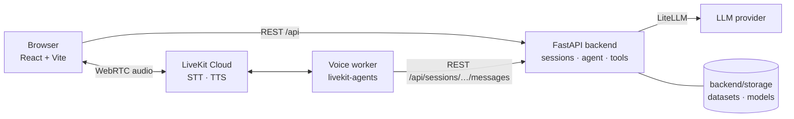

# Jarvis

A data analysis assistant you can talk to. Upload a CSV, then ask questions in Turkish by typing or by voice. An LLM agent inspects, cleans and aggregates the data, trains scikit-learn models and backtests price-direction strategies. It works only through validated tools and never runs code that the model generates.

The UI and the voice pipeline are in Turkish.

## Features

- **Text and voice in one conversation.** Typed and spoken messages go to the same backend session, so they share one agent memory and one active dataset.
- **Dataset tools.** Inspect (schema, missing values, duplicates, preview), group-by aggregations, cleaning (drop duplicates or empty rows, fill missing values), arithmetic columns, and a safe JSON expression language for derived features. Transformations never overwrite data. Each one saves a new dataset and records its source and the operations applied.
- **Modeling.** Classification and regression with logistic/ridge regression, random forest, extra trees, decision tree and histogram gradient boosting. Preprocessing is automatic: imputation and one-hot encoding.
- **Text classification.** TF-IDF on words and word pairs with Turkish-aware normalization and logistic regression. The report includes accuracy, weighted F1, a confusion matrix and the most indicative terms for each class.
- **Time series and backtesting.**
  - Features use only past data: multi-horizon returns, volatility, trend, RSI, range, volume ratio and hour of day.
  - Direction model with a chronological, purged train/test split.
  - Cost-aware backtest (long/short or long only, with an optional confidence threshold). It reports return, buy-and-hold return, Sharpe ratio, max drawdown, hit rate and an equity curve.
- **Leakage guards.** Columns named `target_*` and `future_*` can never be used as features. Look-ahead expressions are only allowed when they create those label columns.
- **Workspace UI.**
  - Sidebar with datasets and their lineage, and trained models.
  - Dataset inspector with a group-by analysis builder.
  - Model reports with an equity chart.
  - Downloads: the model as `.joblib`, the report as `.json`.
  - Drag-and-drop CSV upload.

## Architecture



- **Backend** ([backend/](backend/)): FastAPI with a [smolagents](https://github.com/huggingface/smolagents) `ToolCallingAgent` for each session. It reaches any LLM through LiteLLM. The tools call plain service modules (pandas and scikit-learn), and those modules validate every input.
- **Voice worker** ([voice/](voice/)): a separate LiveKit Agents process that talks to the backend over HTTP.
  1. The browser asks `POST /api/sessions/{id}/voice-token` for a token.
  2. It joins the room `jarvis-<session_id>-<nonce>`.
  3. The worker reads the session id from the room name, so voice turns go into the same session as the text chat.
  - Speech-to-text is Deepgram Nova-3 (Turkish), text-to-speech is Cartesia Sonic-3, and voice activity detection is Silero. STT and TTS run through LiveKit Inference, so you don't need separate Deepgram or Cartesia keys.
  - The worker sends transcripts to the UI on the `jarvis.chat` text stream. It publishes a `jarvis.busy` attribute while a request is running. Turns spoken during a request are queued.
- **Frontend** ([frontend/](frontend/)): React and TypeScript, built with Vite. In development Vite forwards `/api` to the backend. In Docker the backend serves the built files itself.

## Agent tools

| Tool | Purpose |
| --- | --- |
| `inspect_dataset` | Row and column counts, dtypes, missing values, duplicates, preview |
| `aggregate_dataset` | Group by a column and compute mean, sum or count over the full data |
| `transform_dataset` | Cleaning and arithmetic columns, saved as a new dataset |
| `derive_features` | Eval-free expression language: arithmetic, logic, `where`, `shift`, `rolling`, `ewm`, `diff`, `pct_change`, datetime parts |
| `select_dataset` | Switch the active dataset of the conversation |
| `train_model` | Tabular classification or regression with a held-out test split |
| `train_text_classifier` | TF-IDF + logistic regression on a free-text column |
| `create_time_series_features` | Features that use only past data, plus `target_up_<h>` and `future_return_<h>` labels |
| `train_direction_model` | Chronological purged split, accuracy against the majority baseline, backtest with trading costs |

## Getting started

Copy the example environment file and fill it in:

```bash
cp .env.example .env
```

### Docker (single service)

```bash
docker compose up --build
```

Open <http://localhost:8000>. The interactive API docs are at `/docs`.

- One container runs the API, serves the UI, and runs the voice worker. The voice worker starts only when the `LIVEKIT_*` variables are set.
- `backend/storage` is mounted into the container, so uploaded datasets and trained models survive restarts.
- Don't run a local `voice_agent.py` against the same LiveKit project while the container is up. LiveKit would split voice sessions between the two workers.

### Local development

Tested with Python 3.14 and Node 24.

```bash
# Backend (http://localhost:8000)
cd backend
python -m venv .venv && source .venv/bin/activate
pip install -r requirements.txt
uvicorn app.main:app --reload

# Voice worker (optional, separate virtual environment)
cd voice
python -m venv .venv && source .venv/bin/activate
pip install -r requirements.txt
python voice_agent.py dev        # or `console` to talk from the terminal without the UI

# Frontend (http://localhost:5173)
cd frontend
npm install
npm run dev
```

## Configuration

| Variable | Required | Description |
| --- | --- | --- |
| `LLM_MODEL_ID` | yes | LiteLLM model id, e.g. `openai/<model>` for any OpenAI-compatible endpoint |
| `LLM_API_KEY` | yes | API key for the LLM provider |
| `LLM_API_BASE` | no | Base URL for OpenAI-compatible providers |
| `LLM_TEMPERATURE` | no | Defaults to `0.2` |
| `LIVEKIT_URL` | for voice | LiveKit Cloud project URL (`wss://…`) |
| `LIVEKIT_API_KEY` | for voice | LiveKit API key |
| `LIVEKIT_API_SECRET` | for voice | LiveKit API secret |
| `JARVIS_API_URL` | no | The backend address the voice worker calls. Defaults to `http://localhost:8000` |

If `LIVEKIT_*` is not set, the app works in text-only mode and the voice token endpoint returns `503`.

## API

| Method | Path | Description |
| --- | --- | --- |
| `GET` | `/api/health` | Health check |
| `POST` | `/api/datasets` | Upload a CSV (multipart field `file`, UTF-8, up to 250 MB) |
| `GET` | `/api/datasets/{id}` | Dataset summary and a 20-row preview |
| `POST` | `/api/sessions` | Create a session |
| `GET` | `/api/sessions/{id}` | Session state: active dataset, datasets, models |
| `PUT` | `/api/sessions/{id}/dataset` | Set the active dataset |
| `POST` | `/api/sessions/{id}/messages` | Send a message to the agent (`mode`: `text` or `voice`) |
| `POST` | `/api/sessions/{id}/voice-token` | LiveKit token and room for the session |
| `GET` | `/api/analysis/operations` | Aggregation catalog, defined in `core/operations.json` |
| `POST` | `/api/analysis/aggregate` | Group-by aggregations for the analysis builder |
| `GET` | `/api/models/{id}` | Model report |
| `GET` | `/api/models/{id}/download` | Trained pipeline (`.joblib`) |
| `GET` | `/api/models/{id}/report/download` | Model report (`.json`) |

## Project structure

```
backend/
  app/
    api/        FastAPI routers
    agent/      agent setup, prompts and tools/
    services/   datasets, preprocessing, training, NLP, time series, backtest
    core/       config and the aggregation catalog
  storage/      uploaded datasets and trained models (gitignored)
voice/          LiveKit worker and backend HTTP client
frontend/       React + TypeScript UI
docker/         container entrypoint
```

## Limitations

- Sessions and agent memory are kept in the backend's memory. A restart clears conversations; datasets and models on disk are kept. Run a single backend process.
- There is no authentication. The app is meant for local, single-user use.
- Backtests are historical simulations, not forecasts or trading advice.
